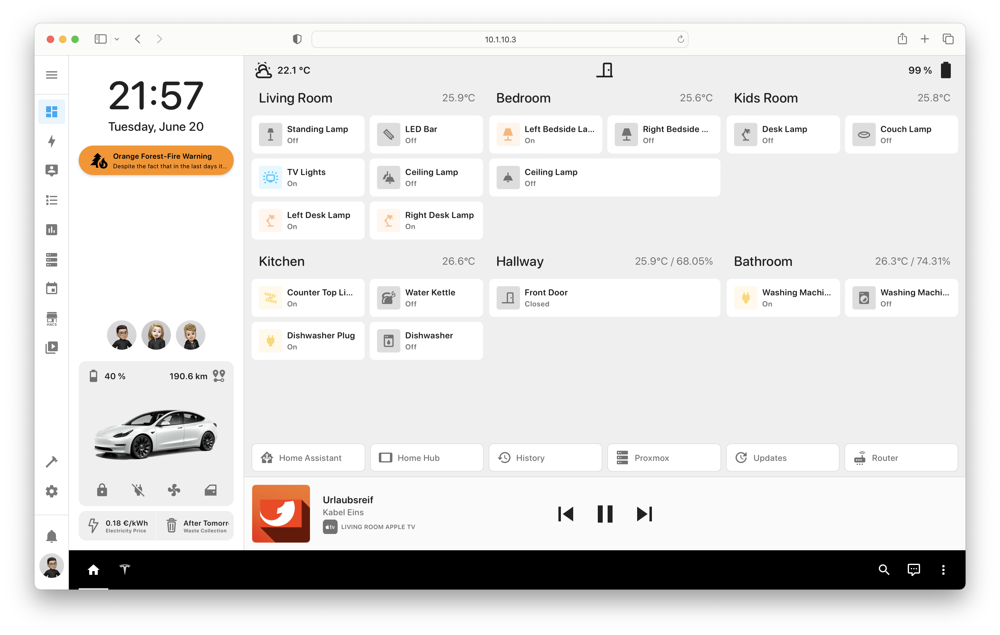

# Home Assistant Configuration

**⚠️ PLEASE NOTE: THIS CONFIGURATION IS STILL A WORK IN PROGRESS ⚠️**

*I wanted to share my current setup with you, but please be aware that it's still a work in progress. I'm continuously refining and updating it to ensure optimal performance and functionality. Feel free to use it as a reference, but keep in mind that some adjustments may be necessary based on your specific requirements and devices.*

---

As many users on the [Home Assistant subreddit](https://www.reddit.com/r/homeassistant/comments/13xdgg2/wip_building_new_dashboard_from_scratch_w_minimal/) have expressed interest in sharing the configuration, I am happy to provide mine! I will make sure to regularly update it to keep it current.

My [Home Assistant](https://www.home-assistant.io) configuration is based on my home server, which utilizes a 2012 Mac mini running [Proxmox VE 7.4](https://www.proxmox.com/en/proxmox-ve) as the primary operating system for managing Virtual Machines and Linux Containers. Within this setup, Home Assistant is running as a [Home Assistant Container](https://www.home-assistant.io/installation/linux#install-home-assistant-container) within a [Linux Container](https://pve.proxmox.com/wiki/Linux_Container).

For convenient control of my smart home, I primarily use a wall-mounted [Samsung Galaxy Note 10.1](https://www.samsung.com/de/support/model/GT-N8010ZWADBT/) with [Fully Kiosk Browser](https://www.fully-kiosk.com/#get-kiosk-apps). This setup allows me to efficiently manage and monitor my smart devices. Additionally, I have exposed the configuration to [Apple HomeKit](https://developer.apple.com/documentation/homekit), enabling access to the smart devices through an Apple HomePod mini hub even when I'm outside my local network.

## Installation

Below is the complete configuration of my setup. Feel free to use it as a starting point and customize it to fit your devices. By following this configuration, everything should work seamlessly with your setup.

## Integrations

### Configuration -> Integrations

- [Apple TV](https://www.home-assistant.io/integrations/apple_tv) - 3 devices
- [Browser mod](https://github.com/thomasloven/hass-browser_mod/blob/master/README.md) - 1 device
- [Fully Kiosk Browser](https://www.home-assistant.io/integrations/fully_kiosk) - 1 device
- [HACS](https://hacs.xyz/docs/configuration/start) - 1 service
- [HomeKit Bridge](https://www.home-assistant.io/integrations/homekit) - 1 service
- [iCloud3 v3](https://gcobb321.github.io/icloud3_v3/#/) - 5 devices
- [Internet Printing Protocol (IPP)](https://www.home-assistant.io/integrations/ipp) - 1 device
- [Linksys Velop](https://github.com/uvjim/linksys_velop) - 3 devices
- [Local Calendar](https://www.home-assistant.io/integrations/local_calendar) - 1 entity
- [Meteorologisk institutt (Met.no)](https://www.home-assistant.io/integrations/met) - 1 service
- [Mobile App](https://www.home-assistant.io/integrations/mobile_app) - 2 devices
- [MQTT](https://www.home-assistant.io/integrations/mqtt) - 28 devices
- [Nordpool](https://github.com/custom-components/nordpool/) - 1 device
- [Pi-hole](https://www.home-assistant.io/integrations/pi_hole) - 1 device
- [Powercalc](https://github.com/bramstroker/homeassistant-powercalc) - 12 devices
- [Samsung Smart TV](https://www.home-assistant.io/integrations/samsungtv) - 1 device
- [Sun](https://www.home-assistant.io/integrations/sun) - 1 service
- [Thread](https://www.home-assistant.io/integrations/thread) - 1 entry
- [Tuya](https://www.home-assistant.io/integrations/tuya) - 4 devices
- [UPnP/IGD](https://www.home-assistant.io/integrations/upnp) - 1 device
- [Version](https://www.home-assistant.io/integrations/version) - 1 service
- [WiZ](https://www.home-assistant.io/integrations/wiz) - 2 devices
- [Xiaomi Miio](https://www.home-assistant.io/integrations/xiaomi_miio) - 1 device

### HACS

#### Integrations
- [iCloud3 v3 iDevice Tracker](https://github.com/gcobb321/icloud3_v3)
- [Powercalc](https://github.com/bramstroker/homeassistant-powercalc)
- [browser_mod](https://github.com/thomasloven/hass-browser_mod)
- [HACS](https://github.com/hacs/integration)
- [nordpool](https://github.com/custom-components/nordpool)
- [Linksys Velop](https://github.com/uvjim/linksys_velop)

#### Frontend
- [layout-card](https://github.com/thomasloven/lovelace-layout-card)
- [Custom brand icons](https://github.com/elax46/custom-brand-icons)
- [card-mod](https://github.com/thomasloven/lovelace-card-mod)
- [button-card](https://github.com/custom-cards/button-card)
- [Mushroom](https://github.com/piitaya/lovelace-mushroom)
